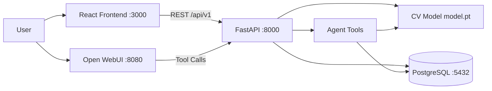

# Architecture — Package Damage Detection

TODO: draw the system diagram here (spec §45 workflow). Suggested Mermaid:

## Components
| Component | Tech | Role |
|---|---|---|
| Frontend | React + Vite (nginx) | upload, preview, results, history, dashboard |
| Backend | FastAPI + uvicorn | REST API, validation, error handling |
| Model service | PyTorch (torchvision) | load model once, preprocess, predict |
| Database | PostgreSQL 16 | persist predictions |
| Agent | LLM (tool calling) | answer questions with real data |
| Chat UI | Open WebUI | chat + (optional) voice |
| Orchestration | Docker Compose | multi-service runtime |
| Deployment | Dokploy | public production hosting |

## Key decisions to document (spec §50 prep)
- Model loaded once at startup, not per request.
- Containers use Docker service names (postgres:5432), never localhost.
- Backend image builds from repo root (pyproject.toml + uv.lock are at root).
- Predictions are written only after a successful inference.
